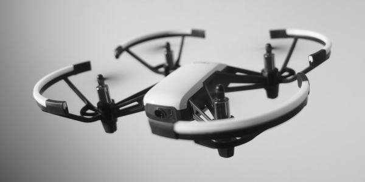

# Pythonic DJI Ryze Tello Workbench

This repository is work in progress. It aims to provide scripts, documentation, hints and helpful assets to enable one creating an application capable of controlling and monitoring a DJI Ryze Tello drone with Python 3.

## Examples

### Live Streaming

An implementation as exemplary for extraction, reassembly, and decoding (with FFmpeg) of h.264 video frames from a sniffed live stream can be found [here](/examples/video).

### Telemetry

A simple script showing sensor data and filter estimations of the drone is located [here](/examples/telemetry).

## Upgrades

### Bumpers

For fewer effects on propellers in the event of a collision, [this](https://www.thingiverse.com/thing:3358009) may be helpful.

## Credits

- Ryze Technology -- [Tello SDK 1.3](https://terra-1-g.djicdn.com/2d4dce68897a46b19fc717f3576b7c6a/Tello%20%E7%BC%96%E7%A8%8B%E7%9B%B8%E5%85%B3/For%20Tello/Tello%20SDK%20Documentation%20EN_1.3_1122.pdf)
- DJI-SDK -- [Collection of python modules that interact with the Ryze Tello drone](https://github.com/dji-sdk/Tello-Python)